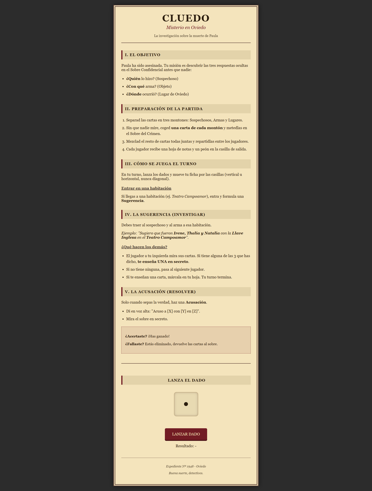
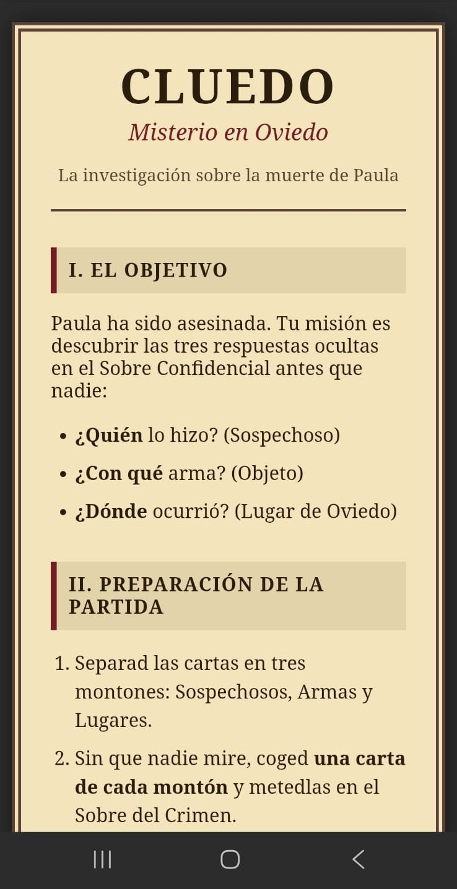

# 🕵️‍♂️ Cluedo: Misterio en Oviedo - Edición Especial

> Una web companion interactiva diseñada como regalo personalizado para jugar al Cluedo ambientado en la ciudad de Oviedo.

## 🌐 Ver Proyecto en Vivo
Puedes visitar la web desplegada aquí:
👉 **[Acceder al Expediente del Caso](https://nataliablancoagudin.github.io/JuegoCluedo/)**

---

## 📜 Descripción
Este proyecto es una aplicación web *Mobile-First* que sirve como manual de instrucciones y herramienta de juego para una edición física personalizada del juego de mesa Cluedo.

La trama gira en torno al "Caso de Paula", situando la acción en localizaciones reales de **Oviedo** (Asturias), como el Teatro Campoamor o el Hotel de la Reconquista, con una estética *Noir* de los años 50.

## ✨ Funcionalidades Principales

* **🎲 Dado 3D Interactivo:** Simulación de físicas de lanzamiento de dados utilizando exclusivamente **CSS3 3D Transforms** y JavaScript (sin librerías externas).
* **📱 Diseño Responsive:** Maquetación adaptable que funciona perfectamente en ordenadores y, especialmente, en dispositivos móviles para ser usada durante la partida.
* **🎨 Estética Vintage:** Uso de texturas de papel, tipografías clásicas (Google Fonts) y paleta de colores temática para inmersión narrativa.
* **📖 Reglamento Integrado:** Explicación clara de la mecánica de juego (Sugerencias vs. Acusaciones).

## 🛠️ Tecnologías Utilizadas

* **HTML5:** Estructura semántica.
* **CSS3:**
    * `perspective` y `transform-style: preserve-3d` para el cubo.
    * Media Queries para la adaptabilidad móvil.
    * Animaciones con `@keyframes` (con soporte `-webkit` para iOS).
* **JavaScript (Vanilla):** Lógica del generador de números aleatorios y control de estados del DOM.

## 📸 Capturas de Pantalla

| Vista Escritorio | Vista Móvil (Dado) |
|:---:|:---:|
|  |  |

---

*Realizado con ❤️ como regalo especial.*
